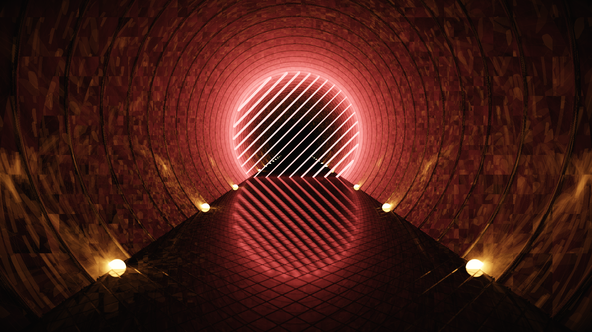

# "Forbidden Path" by yx

This is a procedural artwork released at MAGFest Demoparty 2020, placing 1st in the Graphics competition.

This source code release is for archival reasons - as such, aside from removal of compiled and intermediate binaries, this is an unedited snapshot of the source from when the released artwork was built.

This uses [Shader_Minifier](https://github.com/laurentlb/Shader_Minifier) for shader minification and [Crinkler](https://github.com/runestubbe/Crinkler) for executable compression. Binaries are included in the archive as the exact versions that were used for the release.

Download & comments: https://www.pouet.net/prod.php?which=84472

Some post-mortem thoughts:

* Originally this piece was titled "No Entry", but I was keen to avoid a name collision with the Revision 2018 4K intro [of the same name](https://www.pouet.net/prod.php?which=75834).

* I wanted to explore more stylized rendering approaches with this piece. While it's still pathtraced like my other works, the random number generator is set up such that blocks of neighboring pixels share a seed. This removes the usual noisy artifacts of pathtracing, instead giving a more painterly look.
